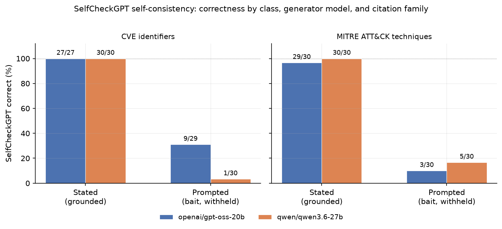
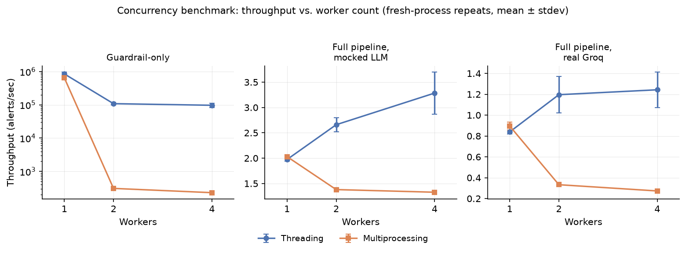

# LLMCite: Grounded Verification of Hallucinated CVE and MITRE ATT&CK Citations in LLM-Generated SOC Reports

**Author:** Emaan Afroz Khuram
**Affiliation:** CNIT/PNTLab Pisa, TECIP, Scuola Superiore Sant'Anna
**Target venue:** International Journal of Information Security (Springer). Backup: SN Computer Science.

---

## Abstract

Large language models are increasingly used in Security Operations Centers to draft threat reports, and those reports often cite CVE identifiers and MITRE ATT&CK techniques as evidence. Almost nothing in a typical deployment checks whether those citations are real, relevant, or actually supported by the alert the model was given. A model can invent an identifier, cite a real one that has nothing to do with the alert, or recall a real, on-topic identifier the alert itself never mentioned. Treating all three as one "flagged" outcome hides the fact that they carry very different risks for an analyst deciding how much to trust the report.

This paper presents LLMCite, a two-stage pipeline that first checks whether a cited identifier is grounded in the alert's own evidence, then verifies any ungrounded ones against authoritative sources — the National Vulnerability Database for CVEs, the MITRE ATT&CK STIX corpus for techniques — and sorts the result into four outcome classes (plus a fifth for formally withdrawn identifiers). The central class, REAL_AND_PLAUSIBLE, names the case a human reviewer is least likely to catch: a real, topically appropriate citation the alert never actually supplied.

Adversarial testing across both citation types shows the pipeline rarely induces spontaneous citation. The paper's main empirical result compares this approach against SelfCheckGPT-style self-consistency checking on the same alerts: self-consistency correctly identifies grounded citations but misses most ungrounded ones, because most of its misses are the model consistently recalling a real, correct identifier from training data — indistinguishable from genuine grounding to a consistency-only signal, but exactly the pattern REAL_AND_PLAUSIBLE exists to catch. The deterministic checker is significantly more accurate on the same alerts (McNemar p=0.012), and the gap holds — and grows sharper — when the entire comparison is repeated on a second, independent model family (p≈2×10⁻⁷). Supporting evaluation — an LLM-judge baseline, real third-party and live SIEM data, and the pipeline's input-guardrail and PII-redaction layers — further validates the system without changing this central finding. LLMCite is a domain-specialized citation-grounding verifier for security-critical LLM applications, distinct from prior work on scholarly citation checking.

---

## 1 Introduction

Large language models are being adopted in Security Operations Centers [10] to triage alerts, enrich threat intelligence, and draft analyst-facing reports. This promises real efficiency gains, but it introduces a risk that's easy to overlook: when a model cites a CVE identifier or a MITRE ATT&CK technique as evidence for its assessment, nothing in a typical deployment checks whether that citation is real, relevant, or actually present in the alert it was given.

This isn't hypothetical. In our own adversarial testing (Sect. 4), models given ambiguous or withheld-identifier prompts either stay silent or occasionally cite something real but unrelated — and a citation that is real but not actually supported by the evidence at hand isn't obviously distinguishable from a correct one without independent verification. An analyst reading a CVE number in a report has no way to tell, from the report alone, which of these happened.

Existing guardrail frameworks like NeMo Guardrails and Guardrails AI are general-purpose input/output filters, not built with a threat-domain ontology for security claims, and none of them verify a technical citation against an authoritative external source. Existing hallucination-detection research — SelfCheckGPT [2], FActScore [6] — establishes the general pattern of decomposing a generation into checkable claims and verifying them, but neither is specialized to a domain where the verification source is a structured, versioned technical database (NVD, MITRE ATT&CK) rather than free-text biography or open-domain knowledge.

To be clear about what's novel here: the underlying pattern — extract a claim, check if it's grounded in the available evidence, verify against an authoritative source if not, classify the outcome — comes from the hallucination-detection literature, most directly FActScore. What this paper contributes is that pattern applied specifically to SOC threat reports, with a four-class taxonomy in place of the binary grounded/ungrounded label most such checkers use, generalized across two distinct claim types: CVE identifiers and MITRE ATT&CK techniques.

The sharper claim, and the one the evaluation is actually built around, is narrower than "we built a taxonomy." REAL_AND_PLAUSIBLE names a failure mode that a leading alternative — self-consistency checking (SelfCheckGPT [2]) — cannot catch, because a model that consistently recalls a real, correct-but-uncited identifier from training knowledge is, by definition, self-consistent. Sect. 4.4 shows this directly: on the same alerts, self-consistency checking is fooled by exactly this pattern in 18 of its 20 failures, while external grounding catches all of them, and the gap is large enough to be statistically confirmed (Sect. 4.5, McNemar p=0.0118) rather than argued from first principles. That comparison is this paper's central empirical contribution; the broader validation that follows (Sect. 4.7 onward) shows the underlying mechanism works in practice, but it supports that one claim rather than standing as a separate contribution of equal weight.

### Contributions

1. **REAL_AND_PLAUSIBLE: a taxonomic distinction that matters empirically, not just conceptually.** A real, topically appropriate citation never actually stated in the evidence is the case most likely to evade human review, precisely because it looks correct. A SelfCheckGPT-style self-consistency baseline, run on the same alerts as the deterministic pipeline, cannot distinguish this pattern from genuine grounding — it's fooled by exactly the citations REAL_AND_PLAUSIBLE was designed to catch, in 18 of 20 failure cases (Sect. 4.4). The deterministic checker is significantly more accurate on the same alerts (McNemar p=0.0118, Sect. 4.5), and the same comparison, repeated on a second, independent model family (`qwen/qwen3.6-27b`), reproduces the gap even more strongly (p≈2×10⁻⁷) — closing the single-model-generalization question this finding would otherwise leave open.
2. **A domain-specialized, two-stage citation-verification pipeline** for SOC LLM reports: a fast deterministic grounding check, followed by authoritative-source verification (NVD for CVEs, the MITRE ATT&CK STIX corpus for techniques) only for citations that fail grounding, classified into a four-class taxonomy (plus a fifth, REJECTED/REVOKED, for formally withdrawn identifiers) that generalizes across two distinct claim types.
3. **Broad empirical validation** that the pipeline works in practice — reported to support Contribution 1, not as evidence of equal weight: bait-style adversarial tests for both claim types (150 CVE identifiers, 150 MITRE ATT&CK techniques), a 76-incident run through an independent third-party incident generator, a 60-alert CVE pool isolating whether the model can identify a CVE from behavior alone versus merely verify one it's given, 139 real alerts across five trigger types from a live Wazuh SIEM deployment including a genuinely detected brute-force attack, a pooled cross-source summary spanning 575 alerts, and supporting evaluation of the pipeline's other guardrail layers — an input-guardrail comparison against two open-source alternatives, a same- and cross-family LLM-judge baseline in full agreement with the deterministic pipeline, a PII-leakage bait test (n=60, 12.5% detection rate), and a human validation of the relevance classifier underlying the taxonomy split (92.5% accuracy).

The rest of the paper is organized as follows: Sect. 2 reviews related work; Sect. 3 describes the pipeline and taxonomy; Sect. 4 presents the evaluation; Sect. 5 discusses what the results do and don't establish, including limitations; Sect. 6 concludes.

---

## 2 Related Work

**Hallucination detection and grounding.** Hallucination — fluent, confident output that isn't grounded in any real source — is a well-documented problem across LLM applications generally [9], not specific to the SOC domain this paper targets. SelfCheckGPT [2] detects likely-hallucinated sentences by sampling several stochastic responses to the same prompt and measuring how consistent they are, without needing an external knowledge source. That's a fundamentally different signal from what LLMCite measures: SelfCheckGPT asks "is the model consistent about this claim," while LLMCite asks "is this claim actually true, checked against an authoritative record." The two are complementary rather than competing, and Sect. 4.4's direct comparison makes that empirical rather than only architectural: consistency is an accurate signal for the grounded class, but blind to a specific failure mode — a real, correct identifier recalled from training knowledge and repeated identically across resamples, which is self-consistent by definition even though it never appears in the evidence the model was actually given. FActScore [6] is the closer methodological ancestor: it decomposes long-form generations into atomic facts and checks each against a reference corpus (Wikipedia), finding that even strong commercial models achieve only about 58% atomic-fact precision on biographical text. LLMCite specializes that same pattern — decompose, ground, verify, classify — to a domain where the reference corpus is a structured, versioned technical database rather than open-domain prose, and where CVE and ATT&CK identifiers have an unambiguous ground truth that free-text biographical claims rarely do. Closer still on the problem itself, if not the domain, is Liu et al.'s audit of generative search engines [22]: across Bing Chat, NeevaAI, perplexity.ai, and YouChat, only 51.5% of generated sentences were fully supported by their attached citations, and only 74.5% of citations actually supported the statement they were attached to. That's the same failure this paper is built around — a citation that's present and looks right but isn't backed by what it's attached to — measured in open-domain search rather than security telemetry, and without a taxonomy distinguishing why a citation fails to hold up. A closer-sounding but structurally different line of work checks LLM-generated *academic* citations specifically: Walters and Wilder [23] find ChatGPT fabricates 55% (GPT-3.5) to 18% (GPT-4) of the bibliographic citations in short literature reviews it's asked to write, with further substantive errors in many of the real ones. That's citation hallucination in the everyday sense, but the check there is whether a cited paper exists and says what it's credited with saying, against the scholarly literature at large — the model is asked to write a review from its own knowledge, with no source document to be grounded in. LLMCite's grounding stage (Sect. 3.4) turns on exactly the distinction that setting has no equivalent for: not just whether a CVE or technique exists, but whether the specific alert in front of the model actually supports citing it.

**LLM-as-judge evaluation.** Zheng et al. [8] show strong LLM judges reach human-comparable agreement on open-ended response quality, but document real biases — position, verbosity, self-enhancement — that matter specifically when the judge and the generator share a model family. Sect. 4.10.2 reports two LLM-judge baselines against the same CVE/ATT&CK citation task LLMCite's deterministic pipeline evaluates: a same-family judge (`openai/gpt-oss-20b`, the model used for report generation) and, addressing Zheng et al.'s own recommendation directly, a second, independently hosted model family (`qwen/qwen3.6-27b`) judging a calibration set built the same way — though not, as Sect. 4.10.2 discloses, the identical sample set, since the underlying bait-alert pool grew between the two runs. Both are reported; the cross-family run was 442/450 (98%) complete at the time of writing, and the completed portion is included rather than withheld.

**Prompt injection and guardrail frameworks.** InjecAgent [1] establishes the threat model LLMCite's input guardrail defends against — instructions hidden inside tool or log output that a downstream agent processes as legitimate input, rather than instructions from a trusted user. NeMo Guardrails [4] was evaluated directly early in this project as a candidate input-guardrail framework; its LLM-based Colang intent classification proved unreliable for injection detection against a small local model, which is why LLMCite's own guardrail starts with deterministic pattern matching instead (Sect. 3). The Instruction Hierarchy [7] addresses the same underlying problem — distinguishing trusted from untrusted instruction sources — at the model-training level via fine-tuning, which is the right fix in principle but isn't available when the report-generation model is a third-party hosted API rather than one this project can fine-tune. LLMCite's input guardrail is instead a runtime, deployment-side control that works with the models actually available in practice.

**Grounding for structured security artifacts.** TRAM [3] is the closest existing system to LLMCite's ATT&CK component, but it solves a different problem: it extracts ATT&CK technique mentions from *trusted*, analyst-authored threat intelligence reports. It doesn't address the adversarial case this paper targets — a model fabricating a technique ID that was never in the source, or citing a real-but-irrelevant one. TRAM is extraction from trusted text; LLMCite is adversarial verification of a claimed citation.

**PII protection.** Presidio [5] implements this project's third threat category — PII leakage in generated reports, T3. Sect. 3.6 describes the guardrail, Sect. 4.10.3 its bait-test result. Unlike the CVE/ATT&CK grounding checks (Sect. 3.4), T3 is a redaction problem, not a citation-verification one: the question is whether sensitive data in the raw alert survives unredacted into generated text, independent of whether any accompanying citation is grounded.

**Comparable commercial systems.** Deployed LLM-assisted SOC products — Microsoft Security Copilot, Google Chronicle/Gemini for Security, IBM QRadar Advisor with Watson, Elastic AI Assistant for Security, CrowdStrike Charlotte AI — produce analyst-facing triage summaries, but none of their public technical documentation describes verifying individual technical citations against an authoritative source, and none expose a reviewer-auditable classification of why a given claim should or shouldn't be trusted. That's the concrete contrast behind LLMCite's contribution: every commercial system in this category currently asks an analyst to trust its output as a black box.

---

## 3 Proposed Method

### 3.1 Threat model

**Table 1** Threat model: attack types addressed by this pipeline's input and output guardrail layers

| # | Attack type | Description | Guardrail layer |
|---|---|---|---|
| T1 | Direct prompt injection | Alert/user input contains instruction-override phrases ("ignore previous instructions") attempting to hijack agent behavior | Input |
| T2 | Indirect prompt injection | Adversarial instructions embedded inside ingested alert/log data, processed as part of normal triage | Input |
| T3 | PII leakage | Sensitive data in raw alerts (names, IPs, emails, SSNs) surfaces unredacted in the generated report | Output |
| T4 | Hallucinated citation | Agent fabricates or misattributes a CVE ID or ATT&CK technique not grounded in the source alert | Output |

T1 and T2 are addressed by the input guardrail (Sect. 3.2); T4 is the paper's headline contribution (Sects. 3.3–3.4); T3 is addressed by a dedicated redaction guardrail (Sect. 3.6), bait-tested in Sect. 4.10.3.

### 3.2 Input guardrail layer

The input guardrail first runs deterministic substring matching against a fixed list of known injection phrases, at near-zero latency. Text that passes falls back to Pytector [14], a local DeBERTa-based prompt-injection classifier, so paraphrased or novel injection attempts the deterministic list misses still get a second chance to be caught. This ordering matters for both latency (most legitimate traffic never needs the model call) and coverage (the deterministic layer alone has a significant recall gap, quantified in Sect. 4.10.1).

### 3.3 Evidence Pack

Rather than running grounding checks against the full formatted alert string — a mix of IPs, timestamps, protocol fields, and free text — an explicit Evidence Pack is built per alert, separating structured fields (IPs, hosts, users, file hashes, ports) from the free-text `description` and `payload_snippet` fields that any CVE/ATT&CK grounding check actually runs against. This makes the grounding surface an explicit, auditable object attached to every report, rather than an artifact of how a prompt happened to be formatted.

### 3.4 Output guardrail: two-stage grounding and verification

**Stage 1 — grounding.** Any CVE-style (`CVE-YYYY-NNNNN`) or ATT&CK-style (`Txxxx[.xxx]`) identifier is extracted from the generated report's text fields by regex, then checked against the Evidence Pack's `text` field. If it's present, it's grounded — the model isn't being scored against a citation the alert never mentioned. If it's absent, it moves to Stage 2.

**Stage 2 — authoritative verification.** Ungrounded CVE identifiers are looked up live against the National Vulnerability Database [18] (NIST's public API — no hosted-LLM call, no API key). Ungrounded ATT&CK identifiers are checked against a periodically refreshed local snapshot of the MITRE ATT&CK [17] Enterprise STIX bundle (858 techniques as of the current snapshot; no lightweight per-ID lookup endpoint exists for ATT&CK the way NVD provides for CVEs, so this is a disclosed tradeoff, not treated as equivalent to the live CVE lookup). A deterministic, stemmed bag-of-words overlap score between the alert's evidence text and the authoritative record's own description determines relevance, validated against human judgment in Sect. 4.6.

### 3.5 Classification taxonomy

**Table 2** The four-class outcome taxonomy applied to every ungrounded citation (plus REJECTED/REVOKED for formally withdrawn identifiers)

| Class | Meaning |
|---|---|
| **FABRICATED** | The identifier does not exist in the authoritative source at all |
| **REAL_BUT_IRRELEVANT** | The identifier is real but its authoritative description does not topically match the alert |
| **REAL_AND_PLAUSIBLE** | The identifier is real and topically matches — likely a correct recall the model made without being given the number, not a fabrication, but still *unverified as actually grounded in this specific alert* |
| **UNVERIFIED** | The authority source could not confirm or deny (e.g. no English-language description available, or the source was unreachable) |
| **REJECTED** (CVE) / **REVOKED** (ATT&CK) | The identifier is formally withdrawn/deprecated by its authority |

Every ungrounded citation sets `requires_review = True` unconditionally, regardless of class. That's a deliberate choice, not an oversight: an earlier version of the pipeline treated REAL_AND_PLAUSIBLE as self-evidently safe and didn't flag it. We changed this after recognizing that REAL_AND_PLAUSIBLE is precisely the case a human reviewer is *least* likely to catch on a manual read-through, since it looks correct — making it the highest-risk category for silent trust, not the lowest.

### 3.6 PII redaction guardrail

Addressing T3, `src/guardrails/pii_guardrail.py` runs Presidio's analyzer together with spaCy's `en_core_web_sm` NER model over the generated report's text fields (`threat_summary`, `recommended_action`, `reasoning`), detecting PERSON, EMAIL_ADDRESS, PHONE_NUMBER, US_SSN, and CREDIT_CARD entities and redacting each to a typed placeholder (e.g. `<PERSON>`) via Presidio's anonymizer. This runs entirely locally, with no additional hosted-API call beyond the report-generation call itself. Its result is OR'd into the same `output_guardrail_flagged`/`requires_review` signals the grounding checks set (Sect. 3.4), rather than treated as a separate channel a reviewer has to check independently. IP_ADDRESS is deliberately excluded from the default entity set: the Evidence Pack (Sect. 3.3) already treats source/destination IPs as operational security telemetry an analyst needs to act on, not personal data to hide by default — redacting it would break the report's usefulness for the overwhelming majority of alerts, which all carry IPs.

---

## 4 Evaluation

### 4.1 Experimental setup

Report generation uses Groq's [20] hosted inference (`openai/gpt-oss-20b`) as the LLM backend throughout, having migrated from an earlier `llama-3.1-8b-instant` baseline. All guardrail components — deterministic matching, Pytector, LLM Guard, NVD/ATT&CK verification — run locally, with no sensitive alert data sent to any hosted API beyond the report-generation call itself. The input-guardrail comparison (Sect. 4.10.1) additionally reports package versions and environment details alongside its results file (`experiments/results/guardrail_comparison.json`) for reproducibility. The project's core test suite currently stands at 145 passing / 1 failing — the one failure is a pre-existing async-fixture issue in an abandoned, unrelated NeMo Guardrails experiment kept for historical record, not part of the shipped pipeline.

**Reproducibility metadata.** The MITRE ATT&CK verification path (Sect. 3.4) uses a local snapshot of the Enterprise STIX bundle (`data/mitre_attack/enterprise_attack_techniques.json`), fetched from MITRE's official `attack-stix-data` GitHub repository on 2026-08-04, containing 858 techniques (SHA-256: `3655344c1b3428392994a947cb13b04b2236a6818b9ce9e35084db98b4fbd08f`). The CVE verification path, unlike ATT&CK's, queries NVD's public API live, per citation, at experiment run time rather than against a fixed snapshot — each results file in `experiments/results/` carries the run timestamp its citations were checked against, so a citation verified as FABRICATED or REAL_AND_PLAUSIBLE reflects NVD's state at that specific time, not one fixed point shared across every result in this paper. This asymmetry — one path versioned and reproducible, the other live and time-varying — is a disclosed property of the two authoritative sources' own APIs, restated in Sect. 5's limitations.

### 4.2 Output guardrail: CVE-bait adversarial test

The CVE-bait set grew from an initial n=6 to n=150 real CVEs across three passes (2026-08-12, 2026-08-12, 2026-08-25), the later additions sourced in bulk from CISA's Known Exploited Vulnerabilities (KEV) catalog, with each alert's behavior description paraphrased from that CVE's own published description — vendor/product name and CVE framing stripped, so the test still measures spontaneous citation rather than pattern-matching a restated name. All 150 numbers are real and individually verified. Three of the 150 alerts explicitly ask the model to name an identifier it wasn't given; the remaining 147 are purely symptom-only.

**Result** (`experiments/results/cve_bait_results.json`, n=150): 2/150 alerts (1.3%, 95% Wilson CI [0.4%, 4.7%]) produced an ungrounded CVE citation — a blended figure that conflates two different conditions. **0/147 symptom-only alerts ever produced a spontaneous citation** (95% CI [0.0%, 2.6%]); both hits come from the 3 explicit-ask alerts, once correct and once with a real-but-wrong neighbor (below). The 0/147 figure is the right headline number for spontaneous hallucination rate. `requires_review` for this set is 5/150 (3.3%), which is not the same as the ungrounded rate — 3 of the 5 are the PII guardrail firing on a single-word product name (`Zimbra`, `Ray`, `Joomla`) misread as a person's name (Sect. 3.6, 4.10.3), not a grounding error. A metric-definition bug conflating the two was found and fixed during this expansion (`docs/all_results.md` #44).

Of the two ungrounded citations: the Log4Shell alert (`BAIT-002`) correctly produced `CVE-2021-44228`, classified REAL_AND_PLAUSIBLE — still flagged for review since the alert text never stated the number, a policy choice rather than an error. The Follina alert (`BAIT-017`) produced `CVE-2022-34713` ("DogWalk") instead of the correct `CVE-2022-30190` — a real, separate Microsoft MSDT vulnerability from the same disclosure window, classified REAL_BUT_IRRELEVANT. This is a concrete instance of exactly the risk this paper's introduction describes: a real identifier, confused with a closely related one, indistinguishable from a correct citation without independent verification. It's the only one of the 150 alerts where the model's citation was actually wrong, rather than correct-but-flagged. Neither of the two hits is REJECTED — no alert in this set produced a formally withdrawn CVE — so that fifth class is exercised on the ATT&CK side (Sect. 4.3's REVOKED case) but remains untriggered, not just unobserved, on the CVE side across all 150 CVE-bait alerts.

### 4.3 Output guardrail: ATT&CK-bait adversarial test

A parallel bait set covers MITRE ATT&CK technique citations, expanded from n=6 to n=150 across two passes (2026-08-21, 2026-08-25). Every technique paraphrases its real, official MITRE description into symptom-only EDR/log-style telemetry, never stating the technique name or ID, with an automated check confirming no ID-shaped token or the technique's own name leaks into the alert text. Two of the 150 alerts explicitly request a technique ID — a smaller share than CVE-bait's 3/150, not an intentional match.

**Result** (`experiments/results/attack_bait_results.json`, n=150): 6/150 alerts (4.0%, 95% Wilson CI [1.8%, 8.5%]) produced an ungrounded ATT&CK citation. Of the 148 symptom-only alerts, 4/148 (2.7%, 95% CI [1.1%, 6.7%]) produced one; both explicit-ask alerts produced one (2/2). Of the 6: two named the expected technique exactly (`ATTACK-BAIT-023`, `ATTACK-BAIT-081`, both REAL_AND_PLAUSIBLE). A new finding beyond anything CVE-bait produced: `ATTACK-BAIT-005` cited `T1076`, a technique ID that exists in the STIX snapshot but is marked `revoked` — MITRE's own record of a deprecated/superseded ID — classified REVOKED rather than REAL_BUT_IRRELEVANT: a real identifier that no longer represents an active part of the framework, the ATT&CK equivalent of citing a withdrawn CVE. The remaining three (`ATTACK-BAIT-006`, `-078`, `-116`) are REAL_AND_PLAUSIBLE/REAL_BUT_IRRELEVANT wrong-neighbor citations in the same shape as CVE-bait's Follina/DogWalk case — `ATTACK-BAIT-006` is a particularly close miss, citing sub-technique `T1542.003` when the expected parent technique was `T1542`.

**What this shows.** The grounding-and-classify pattern generalizes to a second, structurally different claim type — a static STIX snapshot rather than a live per-ID API — the concrete evidence behind Contribution 2's generalization claim. The REVOKED case also shows the taxonomy earning its keep on a case CVE-bait's own set never produced: a real-but-deprecated identifier, materially different from either a correct citation or an outright fabrication.

### 4.4 The central empirical result: SelfCheckGPT versus deterministic grounding

**Method.** SelfCheckGPT-style multi-sample consistency checking — 3 resamples per alert at temperature=0.7 (production runs at temperature=0.1, Sect. 4.1, which would give resampling no diversity to measure) — against the same 60-alert CVE pool used in Sect. 4.7 (30 "prompted"/bait alerts with the CVE withheld, 30 "stated" alerts with the CVE given). `sample_citations()` bypasses the guardrail pipeline entirely, so only the raw generator's citation behavior across resamples is measured — making the self-consistency-vs-external-grounding contrast from Sect. 2 empirical rather than only architectural.

**Result** (`experiments/results/selfcheckgpt_results.json`, n=60; 4 alerts excluded where every resample declined to cite anything — nothing to score consistency on, 3 from the stated class and 1 from prompted):

**Table 3** SelfCheckGPT self-consistency baseline: correctness by grounded/prompted class (n=60, 4 excluded)

| Class | n scored | SelfCheckGPT correct |
|---|---|---|
| Stated (grounded) | 27 (3 declined) | 27/27 |
| Prompted (bait, withheld) | 29 (1 declined) | 9/29 (recall 0.31) |

**Figure 1** 
SelfCheckGPT self-consistency: correctness by class (Stated/Prompted) and generator model. Both `openai/gpt-oss-20b` (this section's result) and a cross-family re-run of this same experiment with `qwen/qwen3.6-27b` (Sect. 4.5) are perfect on the Stated/grounded class; both collapse on the Prompted/withheld class, with `qwen` collapsing further still (1/30 vs. 9/29) — the same blind spot shows up more strongly on a second, independent model family, not less.

Overall on the 56 scored alerts: accuracy 0.643 (95% CI [0.512, 0.755]), precision 1.0 (95% CI [0.701, 1.0]), recall 0.310 (95% CI [0.173, 0.492]). SelfCheckGPT never false-flags a grounded citation as unstable, matching Sect. 4.7's stated-class finding.

**The 20 missed prompted-class alerts aren't what a bare recall number suggests.** All 20 are cases where the model cited the same CVE across all 3 resamples — perfectly self-consistent, so SelfCheckGPT correctly reports no instability. But checking each majority citation against ground truth shows 18 of the 20 are the correct identifier: the model consistently recalled the real CVE from its own training knowledge, even though it was withheld and never appears in the alert's evidence. Only 2 of 20 are genuine misattributions, both citing CVE-2021-31207 (a real Exchange Server vulnerability from the same 2021 ProxyShell cluster) in place of the alerts' actual ground truth (CVE-2021-34473, CVE-2021-26855).

**What this means.** SelfCheckGPT cannot distinguish "consistently grounded" from "consistently correct but ungrounded," because both look identical to a consistency-only signal. Eighteen of these twenty cases are, functionally, REAL_AND_PLAUSIBLE citations (Sect. 3.5) at a volume this project's low-temperature (0.1) bait tests (Sects. 4.2, 4.7) never observed — those recorded exactly one such case across a combined n=106. Raising the sampling temperature to what SelfCheckGPT requires makes the model volunteer a withheld-but-correct identifier far more often than production settings do — a boundary condition on Sect. 4.7's "never volunteers when withheld" finding, which holds at temperature=0.1 specifically, not as a general property of the model. The deterministic grounding checker still correctly flags every one of these 20 as ungrounded, since groundedness is about evidence presence, not real-world correctness — the distinction Sect. 5's central argument is built on. The two misattribution cases echo Sect. 4.2's Follina/DogWalk finding at smaller scale: a real identifier from the right cluster, but the wrong specific one.

### 4.5 Significance testing: deterministic grounding versus SelfCheckGPT

A paired McNemar test between the deterministic pipeline and SelfCheckGPT needed a separate run rather than reusing Sect. 4.4's data: `sample_citations()` bypasses the guardrail pipeline, so the deterministic checker's actual verdict was never computed on those 60 alerts — only the bait/stated construction's ground-truth label was, and treating that label as a stand-in for the checker's verdict would make the comparison tautological. We generated one fresh report per alert (not three — the deterministic checker needs no resampling) at the same temperature=0.7, over the identical 60-alert set, and ran the real deterministic checker against each (`experiments/evaluation/selfcheckgpt_significance_test.py`).

**Result** (`experiments/results/selfcheckgpt_vs_deterministic_mcnemar.json`, n=56 after excluding the same declined-every-sample alerts Sect. 4.4 excludes): both correct in 32 cases, the deterministic checker uniquely correct in 16, SelfCheckGPT uniquely correct in 4, both wrong in 4 — exact binomial McNemar p=0.0118, significant at α=0.05. This is the one comparison in this paper where a raw performance difference is both large and statistically confirmed rather than resting on argument alone: the deterministic checker was right 4× more often than SelfCheckGPT on the exact same alerts. The deterministic checker's own accuracy across all 60 was 52/60 (100% on the stated class, 73.3% on the prompted class).

Sect. 4.10.2's LLM-judge result showed zero disagreement with the deterministic pipeline (100% both ways), which — like Sect. 4.10.1's degenerate LLM-Guard-vs-hybrid trial — would itself produce a degenerate, zero-discordant-pair McNemar test rather than a meaningful p-value, so it wasn't run.

**Cross-family replication.** Sects. 4.4–4.5 above use `openai/gpt-oss-20b` throughout, disclosed in Sect. 5 as a single-model limitation. Both were re-run in full with `GENERATOR_MODEL=qwen/qwen3.6-27b` — a genuinely different, independently-hosted model family — as the report generator for both the SelfCheckGPT resampling (Fig. 1) and the paired significance test. **Result** (`experiments/results/selfcheckgpt_vs_deterministic_mcnemar_qwen_qwen3_6_27b.json`, n=60, 0 excluded): both correct in 31 cases, the deterministic checker uniquely correct in 29, SelfCheckGPT uniquely correct in 0, both wrong in 0. The same-family test above uses the exact binomial form of McNemar's test, appropriate for its 16-vs-4 split; here, with SelfCheckGPT winning zero of the 29 discordant pairs, the exact binomial test degenerates (one cell is 0), so we report the chi-square continuity-corrected form instead — chi-square continuity-corrected McNemar p≈2.0×10⁻⁷. The two tests aren't interchangeable in general, but both are standard McNemar variants and the choice here is forced by the data, not by which one gives a smaller p-value. This is a stronger result than the same-family test above (16 vs. 4, p=0.0118): on qwen-generated reports, SelfCheckGPT never once beat the deterministic checker on any of the 60 alerts. The single-model-generalization limitation Sect. 5 discloses is addressed directly by this result rather than left untested: the central finding holds, and holds more strongly, on a second model family.

### 4.6 Relevance classifier validation

**Method.** The REAL_AND_PLAUSIBLE/REAL_BUT_IRRELEVANT split (Sect. 3.5) rests on Sect. 3.4's Stage 2 relevance score — a deterministic, stemmed bag-of-words overlap between the alert's evidence text and the authoritative record's description, thresholded at 0.15 — which had never been checked against independent judgment before this evaluation.

80 (alert, candidate CVE) pairs were built from the CVE-bait set (Sect. 4.2): 40 anchor alerts, each paired with its own correct CVE and a different real CVE from the same pool by a fixed index shift. Real NVD descriptions were fetched live for all 80 candidates — the same text Sect. 3.4's Stage 2 actually scores. Each pair was labeled relevant/not-relevant by a human rater, blind to which CVE was intended as correct and blind to row order. An AI-suggested first pass (0/80 rater overrides) was followed by a fully blind re-check of the 3 pairs flagged as genuinely ambiguous; all 3 held, including the two closest calls — disclosed as AI-suggested, human-confirmed labeling, not fully independent from-scratch annotation.

**Result** (`experiments/evaluation/relevance_classifier_validation/`, n=80): accuracy 92.5% (95% CI [84.6%, 96.5%]), precision 90.5% (95% CI [77.9%, 96.2%]), recall 95.0% (95% CI [83.5%, 98.6%]), F1 92.7% (TP=38, FP=4, TN=36, FN=2). All 6 disagreements cluster tightly around the 0.15 decision threshold (overlap scores 0.100–0.191) rather than spreading across the full range — a boundary-case failure mode, not general unreliability. One genuinely correct citation scored only 0.100 and was misclassified as irrelevant because its official NVD description is just the bare title "Windows Print Spooler Elevation of Privilege Vulnerability" — almost no text for a word-overlap scorer to match against; a second correct citation missed the threshold by one hundredth of a point.

**What this means.** The relevance classifier is reasonably accurate against human judgment (92.5%), which is what makes the REAL_AND_PLAUSIBLE/REAL_BUT_IRRELEVANT split defensible rather than resting on an unchecked heuristic. Its concrete failure mode — short or generic authoritative descriptions starving a bag-of-words scorer — produces false negatives on genuinely correct citations, a disclosed limitation restated in Sect. 5.

### 4.7 Real-world validation: third-party incident generator and CVE pool

To move beyond hand-authored bait alerts, `Secure_SOC_AI` [21] (an independent, third-party open-source SOC tool) was integrated as an incident *generator* only — its own triage step was not used, since replacing exactly that step is this project's contribution. Its rule engine and correlator produced 76 incidents across all 7 of its shipped detection rules, run through the full LLMCite pipeline.

**Result:** 0% ungrounded on both CVE and ATT&CK citations, 0% requiring review, across all 76 incidents — an expected clean result on non-adversarial, rule-engine-generated incidents, included for completeness rather than as an adversarial stress test (Sects. 4.2–4.3 cover that).

A second, purpose-built 60-alert CVE pool (15 real NVD-listed CVEs, split into **bait** style — exploit behavior described, CVE withheld — and **stated** style — CVE given directly) isolates whether the model can *identify* a CVE from behavior alone, or only *verify* one it's already given.

**Table 4** CVE pool bait-vs-stated comparison: whether the model identifies a withheld CVE from behavior alone, or only verifies one it is given

| Style | n | CVE ungrounded rate | Cited the correct ground-truth CVE |
|---|---|---|---|
| Bait (number withheld) | 30 | 0.0% | **0.0%** |
| Stated (number given) | 30 | 0.0% | 100% |

**This is the most important finding in this subsection.** The model never fabricates a CVE under either framing, but when the number is withheld it also never volunteers the correct one — it stays silent rather than guessing. The pipeline as built only *verifies* claims the model already makes; it doesn't *identify* a CVE from behavior alone — a genuine capability gap motivating specific future work (retrieval-based CVE matching against behavioral description), not a guardrail failure. This finding holds at temperature=0.1; Sect. 4.4 finds the opposite behavior at temperature=0.7 on the same style of alert.

### 4.8 Live integration demonstration: real Wazuh SIEM data

To test against genuinely live, non-synthetic alert data rather than only CICIDS2017 [15] (flagged elsewhere as outdated for current attack-pattern coverage — see Sect. 5), a local Wazuh [19] SIEM/XDR stack was deployed via Docker Compose with a real registered agent, generating real triggering activity across five trigger types: File Integrity Monitoring on an actual file write; a genuine SSH brute-force attempt that Wazuh's correlation engine correctly escalated to a dedicated rule; realistic SQLi/XSS/directory-traversal request lines against Wazuh's web-attack ruleset; rootkit-signature markers via Wazuh's rootcheck module; and sudo/privilege-escalation syslog activity against Wazuh's sudo ruleset.

**Result:** 139 unique alerts (deduplicated, expanded from an original 26) run through the full pipeline: 0% ungrounded on ATT&CK/CVE across all 139. Manual inspection confirmed the model's reasoning engaged with real MITRE technique IDs present in the alerts (T1110 Brute Force on SSH alerts; T1190 Exploit Public-Facing Application on web-attack alerts; T1548.003 Sudo and Sudo Caching on privilege-escalation alerts), once an adapter bug stripping MITRE tags from SSH-rule alerts specifically was found and fixed.

**Two genuine PII-guardrail bugs surfaced by this live data, neither visible on synthetic benchmarks.** First, at n=26, 5 alerts triggered a `PERSON` false positive — the NER model misread technical strings (a URL path, a shell-command fragment, "ATT&CK", a document name) as a person's name. Fixed with a plausibility filter rejecting matches containing characters no real name uses. Second, the bulk expansion to n=139 raised `requires_review` to 27.3% (38/139) before correction — around 35 of the 38 were Presidio's `PHONE_NUMBER` recognizer misreading bare IP addresses, not threshold-fixable since a real IP and a real phone number score identically, so fixed with a structural check rejecting any `PHONE_NUMBER` match that parses as a valid IPv4 address. The corrected result is `requires_review` at 4/139 (2.9%), with zero regression on real-name or real-phone-number detection. The 4 remaining flags are single capitalized words ("Mithra", "Maniac", "Bash", "Benchmark") the model's own report text uses as a rootkit/benchmark name beside "rootkit" or "CIS ... score" — genuinely ambiguous for the NER model, reported as a known limitation rather than overfit to four exact strings.

**Honest limitation:** n=139 is manual, burst-fired activity across several sessions rather than continuous production traffic — enough to demonstrate the pipeline against many real, live-detected attack patterns and to surface two real guardrail bugs, not enough for a precise statistical claim on its own. Wazuh's built-in vulnerability-detector, which would add genuine CVE-tagged alerts, was blocked by a single-node Docker inventory-sync limitation and isn't counted among the 139.

### 4.9 Cross-source grounding summary

Sects. 4.2–4.8 each report a grounding rate on one alert source in isolation. This section pools them into a single cross-source view using only already-reported results — no new alerts or LLM calls (`experiments/evaluation/grounding_benchmark_summary.py`).

**Result** (`experiments/results/grounding_benchmark_summary.json`, 575 alerts total): pooling every CVE-checker source (CVE-bait, Wazuh, Secure_SOC_AI rule engine, Secure_SOC_AI CVE pool; n=425) gives 2/425 (0.47%, 95% CI [0.1%, 1.7%]). Pooling every ATT&CK-checker source (ATT&CK-bait, Wazuh, Secure_SOC_AI rule engine; n=365) gives 6/365 (1.64%, 95% CI [0.8%, 3.5%]). Both non-zero contributions come entirely from the two purpose-built bait sources; the three non-adversarial sources contribute zero ungrounded citations between them.

**Honest limitation.** This pooled figure is five heterogeneous samples with different construction methods combined by simple addition, not a single random sample — per-source rates are reported alongside it for that reason. It inherits each source's own caveats (e.g. Wazuh's vulnerability-detector gap, Sect. 4.8), and formal significance testing between sources wasn't attempted — both bait sets have too few discordant cases for McNemar to say anything meaningful even at n=150 each.

### 4.10 Supporting evaluation: auxiliary guardrails and engineering baselines

Sects. 4.2–4.9 above establish and validate this paper's central claim: the CVE/ATT&CK grounding-and-classify pipeline works across two claim types, and the REAL_AND_PLAUSIBLE class it introduces catches a real, statistically confirmed blind spot in the leading self-consistency alternative. The four subsections below are reported for completeness — they validate the pipeline's other guardrail layers (input filtering, PII redaction), an alternative verification strategy (LLM-as-judge), and engineering-level throughput characteristics — but none bear directly on the paper's central claim, and none should be read as carrying equal evidentiary weight to Sects. 4.2–4.9 above.

#### 4.10.1 Input guardrail comparison

The input guardrail was benchmarked against two maintained open-source alternatives — LLM Guard [13] (Protect AI) and Pytector — on a 119-sample held-out set: 53 injection attempts across exact-pattern, paraphrase, and novel-strategy categories, including samples adapted from `deepset/prompt-injections` [12] and `TrustAIRLab/in-the-wild-jailbreak-prompts` [11]; 66 benign samples including real CICIDS2017 network-flow text. Guardrails AI was excluded after its relevant hub validator was removed from the package index mid-project, and its only remaining alternative required a hosted-API call (full detail: `experiments/evaluation/guardrail_comparison/README_guardrail_comparison.md`).

**Table 5** Input guardrail comparison: precision/recall/latency/throughput across four implementations on the 119-sample eval set

| | Baseline (deterministic) | LLM Guard | Pytector | Hybrid (deterministic + Pytector fallback) |
|---|---|---|---|---|
| Precision | 1.0 | 0.962 | 1.0 | 1.0 |
| Recall | 0.283 | 0.943 | 0.679 | 0.736 |
| F1 | 0.441 | 0.952 | 0.809 | 0.848 |
| False positives | 0 | 2 | 0 | 0 |

Since all 6 pairwise comparisons this project runs share overlapping implementations (`hybrid` appears in 4 of the 6), both raw and Holm-Bonferroni-corrected McNemar p-values are reported:

**Table 6** McNemar significance testing across all 6 pairwise guardrail comparisons, raw and Holm-Bonferroni-corrected

| Comparison | Raw p-value | Sig. (raw α=0.05)? | Holm-Bonferroni p-value | Sig. (corrected)? |
|---|---|---|---|---|
| Baseline vs. Hybrid | <0.001 | **Yes** | <0.001 | **Yes** |
| Hybrid vs. LLM Guard | 0.049 | Yes | 0.196 | **No** |
| Hybrid vs. Pytector | 0.250 | No | 0.500 | No |
| Hybrid+LLM-Guard-fallback vs. Hybrid | 0.049 | Yes | 0.196 | **No** |
| Hybrid+LLM-Guard-fallback vs. LLM Guard | 1.000 | No | 1.000 | No |
| Hybrid+LLM-Guard-fallback vs. Pytector | 0.012 | Yes | 0.059 | **No** |

**Only one of the six comparisons survives correction: hybrid beats the naive deterministic-only baseline** — the core safety claim this layer depends on. The other three raw-significant results sat close to the raw α=0.05 line and don't survive correction; LLM Guard is numerically ahead on recall, but "numerically ahead" and "statistically distinguishable from chance once multiple comparisons are accounted for" are different claims.

A follow-up trial testing LLM Guard as the hybrid's fallback classifier (instead of Pytector) produced a degenerate McNemar test — zero discordant predictions, meaning the two are identical sample-for-sample: the deterministic pre-filter adds value only against a classifier with real blind spots (true for Pytector), not one already near ceiling recall. LLM Guard's and Pytector's originally reported latency figures were also found to be inflated by a one-time model-loading cost on their first call, corrected via an explicit warmup step; single-run latency on shared hardware still varies by about 2.6× between runs, so exact millisecond figures are reported as order-of-magnitude comparisons only, pending repeated-trial benchmarking.

#### 4.10.2 LLM-judge baseline

As an alternative verification strategy, a judge call is prompted directly with an (alert evidence, generated report) pair and asked to classify citations as grounded/ungrounded, without the deterministic pipeline's verdict — run over a class-balanced calibration set with two judges: `openai/gpt-oss-20b` (same-family) and `qwen/qwen3.6-27b` (a genuinely different, independently hosted family, addressing Zheng et al.'s [8] self-enhancement-bias concern directly). Both reproduced the deterministic pipeline's labels exactly: 100% accuracy/precision/recall on the same-family run (n=318, complete, 95% CI [98.8%, 100%]) and the cross-family run (n=450, 442/450 (98%) completed, 95% CI [99.1%, 100%] on 440 scored samples). The two sets aren't sample-for-sample identical — the underlying bait-alert pool grew between runs, so the same-family 318 are a strict subset of the cross-family 450 — but on every shared sample the judges agree 100%.

**This result is weaker evidence than the headline number suggests.** The harder tier's discriminating signal is close to what the deterministic checker already computes — an identifier-shaped token appearing in the evidence — so a capable judge matching it is an expected feasibility floor, not deep semantic reasoning. The defensible claim is narrower: an LLM judge can reproduce this binary decision regardless of model family, while the deterministic pipeline keeps real deployment advantages neither judge shares — near-zero latency, no per-call cost or rate-limit exposure, no dependence on a hosted API.

#### 4.10.3 PII redaction guardrail: bait test (Threat T3)

Unlike Sects. 4.2–4.3's grounding checks, T3 is a redaction threat: does the report echo sensitive data present in the raw alert. The guardrail (Sect. 3.6) runs Presidio [5] and spaCy's `en_core_web_sm` locally.

`experiments/evaluation/pii_bait_alerts.py` built 40 alerts with synthetic PII across 10 scenario types (DLP exfiltration, phishing credential harvest, payment-data exposure, database dump, cloud-storage misconfiguration, and others), plus 20 clean alerts as a false-positive check. Beyond the original 6 PII/8 clean hand-authored alerts, the expansion embeds real synthetic entity values — never real individuals' data — from two verified, actively maintained datasets (Gretel's `gretel-pii-masking-en-v1`, ai4privacy's `pii-masking-openpii-1m`) wrapped in hand-written scenarios, each verified via the guardrail's own detector to actually trigger its stated entity type before inclusion.

**Result** (`experiments/results/pii_bait_results.json`, n=60): 5/40 PII alerts had a genuine detection (12.5%, 95% CI [5.5%, 26.1%]), 0/20 false positives, 0 residual PII after redaction — consistent with the original n=6 rate (16.7%), now with a real confidence interval. All 5 detections caught only one of the alert's two expected entity types, never both; manual inspection of "nothing detected" cases confirms the model (`openai/gpt-oss-20b`) consistently summarizes PII abstractly rather than quoting raw values.

Two of the initial 7 raw detections were false positives — the NER model flagged the bare word "PII" and the phrase "enforce bucket" as `PERSON` — caught by manually checking every detection against its known sourced value rather than trusting the aggregate rate. Fixed by extending the plausibility filter (real names are Title Case; reject lowercase-starting or acronym-shaped spans), correcting the rate from an inflated 17.5% (7/40) to the verified 12.5% (5/40) above.

**What this means.** The model's own summarization behavior is itself a meaningful T3 mitigation; on the cases where it did quote something verbatim, the guardrail worked end to end with zero residual PII and zero false positives elsewhere. And checking a guardrail's aggregate rate is not the same as checking that every individual hit is genuine — a type-level pass/fail check can silently absorb false positives that happen to land on the right label.

#### 4.10.4 Concurrency and throughput benchmarks

An original benchmark (1/2/4 workers, 3 repeats looped inside one long-running process) showed threading's full-pipeline throughput improving from 1 to 2 workers but collapsing sharply at 4 (0.67 alerts/sec), consistent with (though not definitively proven to be) Groq server-side per-key throttling under load; multiprocessing was worse than threading at every worker count.

This was redone on 2026-08-25 to close two gaps: repeats looping inside one long-running process can let OS scheduler/allocator state carry over between them, and there was no way to separate guardrail overhead from live Groq network variance. Fixes: each repeat now runs as a genuinely independent subprocess (`fresh_process_benchmark.py`), and a mocked-LLM variant runs the real guardrail/grounding/redaction pipeline but replaces only the Groq call with a fixed 0.3s delay, free of API cost and rate limits, so it runs at n=30 instead of n=6.

Fresh-process isolation surfaced a real bug: full-pipeline runs with more than one thread crashed on an unlocked lazy-singleton race in the pytector loader (two threads racing on the first concurrent call both started constructing the DeBERTa model at once) — a real production risk, not just a benchmark artifact, fixed with double-checked locking.

**Table 7** Concurrency benchmark, fresh-process repeats (n=3 repeats per configuration; guardrail-only n=2000, mocked-pipeline n=30, real-pipeline n=6)

| Workload | Workers | Threading (alerts/sec) | Multiprocessing (alerts/sec) |
|---|---|---|---|
| Guardrail-only | 1 | 850,323 ± 115,672 | 648,379 ± 41,175 |
| Guardrail-only | 2 | 108,456 ± 9,380 | 309 ± 2 |
| Guardrail-only | 4 | 97,063 ± 14,474 | 230 ± 1 |
| Full pipeline, mocked LLM | 1 | 1.973 ± 0.032 | 2.031 ± 0.018 |
| Full pipeline, mocked LLM | 2 | 2.660 ± 0.140 | 1.380 ± 0.006 |
| Full pipeline, mocked LLM | 4 | 3.284 ± 0.415 | 1.328 ± 0.010 |
| Full pipeline, real Groq | 1 | 0.839 ± 0.019 | 0.896 ± 0.037 |
| Full pipeline, real Groq | 2 | 1.196 ± 0.174 | 0.333 ± 0.006 |
| Full pipeline, real Groq | 4 | 1.243 ± 0.170 | 0.273 ± 0.017 |

**Figure 2** 
Throughput vs. worker count across all three workload types, threading vs. multiprocessing, mean ± stdev. The same pattern repeats in every panel: threading's line climbs as workers increase, multiprocessing's falls — visible at a glance in a way Table 7's nine rows require more work to see.

**What this shows.** The mocked and real-API columns agree in direction at every worker count, validating the mocked variant as a genuine stand-in. Threading's full-pipeline throughput climbs with more workers (real: +48% from 1 to 4 threads) since the GIL releases during network waits, letting threads overlap I/O. Multiprocessing's falls (real: −70%) since each additional process pays its own model-load cost with no offsetting I/O-overlap benefit — the original "process overhead dominates" finding, now with a concrete measured mechanism (the pytector cold-start) behind it. Guardrail-only numbers reproduce the original qualitative pattern (more workers hurts a CPU-bound, microsecond-scale task, far more so for multiprocessing), though the 2/4-worker figures are noisier than the means suggest — `psutil.cpu_percent()`'s 0.1s sampling interval is coarse relative to a sub-millisecond runtime.

**Honest discrepancy, not resolved.** The redone real-API run does not reproduce the original benchmark's sharp 4-thread collapse — 4-thread throughput here is the best of the three worker counts, not the worst. Both runs are n=6, modest statistical power either way; this could be a real but non-reproduced throttling instance, or cross-run interference in the original in-process design (e.g. rate-limit-window state persisting across the sequential 1→2→4 tests). Neither explanation is confirmed — both results are reported rather than one quietly replacing the other.

---

## 5 Discussion

**What REAL_AND_PLAUSIBLE means for trust.** The central practical argument of this paper is that a citation which is real and topically plausible is the *hardest* case for a human reviewer to catch, not the easiest — it looks correct. Sect. 3.5's taxonomy and its unconditional review-flag policy exist specifically because an earlier version of this pipeline got this wrong, treating REAL_AND_PLAUSIBLE as self-evidently safe; the fix is documented as a deliberate correction, not presented as though the pipeline always worked this way. Sects. 4.4–4.5 make this more than an architectural argument: a leading alternative, self-consistency checking, is demonstrably fooled by this exact pattern, and the gap is large enough to be statistically confirmed. Everything reported after Sect. 4.6 exists to show the mechanism producing this result actually works across real, third-party, and live data — it supports this finding, it isn't a separate finding of equal weight.

**Why this comparison, despite how it was measured.** Two questions are worth answering directly rather than leaving for a reader to reconstruct. First: is it actually surprising that self-consistency checking misses this pattern, given that SelfCheckGPT is built to catch *inconsistency*, not *inaccuracy*, and a model that consistently recalls a real identifier is self-consistent by definition? No — that outcome follows from how the method works, and we don't claim otherwise. What Sects. 4.4–4.5 add is a measurement, not a discovery: how often that theoretical gap actually opens up on real citations in this domain (18 of 20 misses, not a handful), and that the gap is large enough to be statistically distinguishable from noise rather than an edge case. A practitioner choosing between building a domain-specific grounding checker and simply resampling a general-purpose model for consistency is choosing based on exactly this kind of number, and the general hallucination-detection literature doesn't supply it for the CVE/ATT&CK domain — SelfCheckGPT's own evaluation never quantifies this failure mode on a citation-grounding task at all.

Second, and more consequential: the comparison runs at temperature=0.7, because SelfCheckGPT's resampling needs diversity to measure anything, while production runs at 0.1 (Sect. 4.1) — and Sect. 4.7, run at the production temperature on the same style of alert, shows the model volunteering a withheld-but-correct CVE 0% of the time. That's a real confound, not a footnote: it's entirely plausible that most of what makes SelfCheckGPT look bad here is temperature-induced volunteering behavior, not something inherent to consistency-checking as a method, and this dataset can't fully separate the two effects. What the confound does *not* touch is the narrower claim underneath it, which is temperature-independent: once a model does volunteer a real, uncited identifier — at whatever temperature, in whatever deployment actually produces one — self-consistency checking cannot flag it, because the citation is stable across resamples by construction, while the deterministic checker flags it every time, because groundedness depends on evidence presence, not on how many times the model repeats the same answer. That mechanism-level claim holds regardless of how often the triggering condition occurs; it is only the specific prevalence (18 of 20, not some other split) that depends on temperature=0.7, and that dependency should be read as attached to Sect. 4.4's headline number, not to the mechanism itself.

**What the CVE-pool finding (Sect. 4.7) means.** The 0%-fabrication / 0%-spontaneous-citation result is really two findings, not one: the pipeline's grounding check isn't the reason the model stays silent (there's nothing to ground-check if nothing is cited) — the model itself, independent of any guardrail, doesn't volunteer technical identifiers it wasn't given. That's safe behavior, but it also means the current system architecturally cannot help an analyst who needs a CVE *identified* from symptoms, only one *verified* once cited. We name this explicitly as the boundary of the current contribution rather than implying broader coverage than what was tested.

**Limitations, stated plainly:**
- Sects. 4.4–4.5 (SelfCheckGPT and its McNemar test) are both complete: the deterministic checker is significantly more accurate (p=0.0118, n=56). Its result also contradicts Sect. 4.7's "never volunteers a withheld CVE" finding at higher sampling temperature (0.7 vs. 0.1) — the same model volunteers a withheld-but-correct identifier once sampled at the temperature SelfCheckGPT requires, so Sect. 4.7's finding should be read as holding at production temperature specifically, not as a general model property. Sect. 4.10.2's LLM-judge baseline now spans same- and cross-model-family judges — 442/450 (98%) complete, quota-gated on Groq's free tier rather than a design limitation.
- Sect. 4.10.2's 100% LLM-judge agreement shouldn't be read as strong evidence on its own: the hard tier's discriminating signal is close to what the deterministic checker already computes, a feasibility floor rather than deep semantic reasoning, not evidence against the deterministic pipeline's necessity.
- The central McNemar comparison (Sects. 4.4–4.5) — the finding the Abstract, Contributions, and Conclusion each lead with — has only been run on the 60-alert CVE pool. It has not been repeated on ATT&CK citations. The taxonomy and grounding pipeline generalize across both claim types (Sects. 4.2–4.3), but the statistically-confirmed self-consistency-versus-grounding gap specifically is CVE-only; whether the same gap, and the same size of gap, holds for ATT&CK technique citations is untested.
- The CVE-bait result (Sect. 4.2, n=150) gives a citable 95% CI ([0.4%, 4.7%]), but both ungrounded citations occurred on the same two famous vulnerabilities (Log4Shell, Follina) — the honest claim is "rarely induces spontaneous citation, catches it on famous cases," not "stress-tested against obscure-CVE hallucination." The ATT&CK-bait result (Sect. 4.3) differs: 4 of its 6 ungrounded citations are on less prominent, wrong-neighbor or revoked-technique cases.
- Sect. 4.10.4's concurrency benchmark uses fresh-process repeats; the input-guardrail latency comparison (Sect. 4.10.1) hasn't had the same treatment, so only order-of-magnitude comparisons should be drawn from it. The Wazuh live demonstration (Sect. 4.8, n=139) is a real-world sanity check and bug-finding exercise, not a statistically powered claim.
- The ATT&CK verification path relies on a periodically refreshed local snapshot (Sect. 4.1) rather than a live per-ID lookup (none exists publicly) — a disclosed asymmetry with the CVE path's live NVD lookups. CICIDS2017, used for benign-traffic text in Sect. 4.10.1, is independently flagged as no longer representative of current attack patterns [16]; it's used here only for `BENIGN`-labeled text, while the live Wazuh integration (Sect. 4.8) is what any current-attack-data claim relies on.
- T3 (PII leakage, Sect. 3.6/4.10.3) is at n=60: 5/40 detected (12.5%, 95% CI [5.5%, 26.1%]), corrected down from an initial 7/40 after 2 false positives were caught by checking sourced values rather than trusting the type-level aggregate.
- The report-generation backend is `openai/gpt-oss-20b` via Groq throughout most of this paper. For the central SelfCheckGPT finding specifically, this is no longer an untested limitation: Sect. 4.5's cross-family replication with `qwen/qwen3.6-27b` reproduces it, more strongly (p≈2.0×10⁻⁷ vs. p=0.0118). The rest of the evaluation — CVE-/ATT&CK-bait, Wazuh, PII, input-guardrail comparison — remains single-model-tested; generalization there is still untested.
- The relevance classifier behind REAL_AND_PLAUSIBLE/REAL_BUT_IRRELEVANT (Sect. 3.4, validated Sect. 4.6) is 92.5% accurate against human judgment (n=80), not perfect — its 6 disagreements cluster at the 0.15 decision threshold, with a known failure mode on short/generic authoritative descriptions. Its labels are AI-suggested and human-confirmed, not independently annotated from scratch. All 80 validation pairs are drawn from the CVE-bait set, so this 92.5% figure validates the scorer's CVE-side behavior only; the same scorer's ATT&CK-side accuracy, against STIX technique descriptions rather than NVD prose, has not been independently checked, despite the two authoritative sources differing structurally in description length and style.

**Threats to validity.** The input-guardrail comparison (Sect. 4.10.1) uses a dataset partly adapted from public sources rather than fully independent attacker data, tracked per-sample via a `provenance` field so this can be audited. The CVE-bait set (Sect. 4.2, n=150) isn't a random sample of all CVEs — it's biased toward well-documented, high-profile, actively exploited vulnerabilities (25 individually chosen for fame, 125 from CISA's KEV catalog), a deliberate choice (an obscure CVE with no public writeup isn't a meaningful spontaneous-citation test either way) that means the estimated rate shouldn't be read as generalizing to arbitrary, less-documented CVEs. The ATT&CK-bait set (Sect. 4.3, n=150) has the analogous bias in the other direction — technique selection is drawn from the local MITRE snapshot rather than any real-world prevalence signal, so its rate reflects how often the model reaches for a specific technique ID given a resembling symptom description, not attacker behavior frequency. Every human-labeled ground truth in this paper — the relevance classifier's 80 pairs (Sect. 4.6) most directly, since it's the only one reported as a citable accuracy figure — comes from a single rater, with no second annotator and no inter-rater agreement statistic; the one check against rater drift is a blind re-check of the 3 pairs flagged as most ambiguous, not independent double-labeling of the full set. This is a real threat to validity, not fully addressed by the "AI-suggested, human-confirmed" disclosure already given for that figure.

---

## 6 Conclusion

We presented LLMCite, a domain-specialized citation-grounding verification pipeline for LLM-generated SOC reports, built around a four-class outcome taxonomy (plus a fifth label for formally withdrawn identifiers) rather than a binary flagged/not-flagged label. The taxonomy's central claim — that a real, topically plausible citation never actually stated in the evidence (REAL_AND_PLAUSIBLE) is the hardest case for a human reviewer to catch, precisely because it looks correct — isn't argued architecturally alone. Sects. 4.4–4.5 demonstrate it directly: at the sampling temperature self-consistency checking requires, the model volunteers real, correct-but-uncited identifiers it stays silent on at production temperature (Sect. 4.7), and does so consistently enough across independent resamples that a SelfCheckGPT-style signal alone cannot tell eighteen of these cases apart from a genuinely grounded citation. External grounding can, because it checks the evidence the model was actually given rather than the model's confidence in its own answer — and the resulting accuracy gap is large enough to be statistically confirmed on the identical alerts (McNemar p=0.0118), not merely observed, and reproduces more strongly still when the whole comparison is repeated on a second, independent model family (`qwen/qwen3.6-27b`, p≈2×10⁻⁷, Sect. 4.5). That distinction — not raw accuracy against a baseline — is what this paper argues a citation-grounding pipeline contributes that self-consistency checking alone doesn't, and it's the one comparison in this paper we'd ask a reader to remember above the rest.

That finding rests on a pipeline validated broadly, though the breadth below is supporting evidence for the claim above, not a set of separate contributions of equal weight. The grounding-and-classify pattern generalizes across two distinct claim types (CVE identifiers via live NVD lookup, MITRE ATT&CK techniques via a local STIX snapshot), evaluated via adversarial bait tests at n=150 for each claim type, an independent third-party incident generator, a CVE pool isolating identification from verification, live SIEM data including a genuinely detected attack, and a pooled cross-source grounding summary spanning 575 alerts across every evaluated source (Sect. 4.9). Supporting evaluation of the pipeline's other guardrail layers — a statistically tested comparison of the input-guardrail layer against maintained open-source alternatives, an LLM-judge baseline spanning both a same-family and cross-family judge (the latter 442/450, 98% complete and quota-gated rather than left as an unaddressed limitation), and a bait-tested PII-redaction guardrail (n=60, 12.5% detection rate, 95% CI [5.5%, 26.1%]) — further validates the system without altering the central finding above.

---

## References

*(Numbered per the target venue's Math and Physical Sciences Numbered reference style, matching `docs/paper/sn-bibliography.bib`. Full BibTeX entries with URLs/DOIs live there; this list is for draft readability.)*

1. Zhan, Q., Liang, Z., Ying, Z., Kang, D. InjecAgent: Benchmarking Indirect Prompt Injections in Tool-Integrated Large Language Model Agents. Findings of ACL, 2024.
2. Manakul, P., Liusie, A., Gales, M. SelfCheckGPT: Zero-Resource Black-Box Hallucination Detection for Generative Large Language Models. EMNLP, 2023.
3. MITRE Engenuity Center for Threat-Informed Defense. TRAM: Threat Report ATT&CK Mapper. v1 2021, LLM-based update 2023.
4. Rebedea, T., Dinu, R., et al. NeMo Guardrails: A Toolkit for Controllable and Safe LLM Applications with Programmable Rails. NVIDIA, 2023.
5. Microsoft. Presidio: An Open-Source Framework for Detecting, Redacting, Masking, and Anonymizing Sensitive Data (PII). GitHub, ongoing.
6. Min, S., Krishna, K., Lyu, X., Lewis, M., Yih, W., Koh, P.W., Iyyer, M., Zettlemoyer, L., Hajishirzi, H. FActScore: Fine-grained Atomic Evaluation of Factual Precision in Long Form Text Generation. EMNLP, 2023.
7. Wallace, E., Xiao, K., Leike, R., Weng, L., Heidecke, J., Beutel, A. The Instruction Hierarchy: Training LLMs to Prioritize Privileged Instructions. arXiv (OpenAI), 2024.
8. Zheng, L., Chiang, W., Sheng, Y., et al. Judging LLM-as-a-Judge with MT-Bench and Chatbot Arena. NeurIPS Datasets and Benchmarks Track, 2023.
9. Huang, L. et al. A Survey on Hallucination in Large Language Models: Principles, Taxonomy, Challenges, and Open Questions. arXiv, 2024.
10. Srinivas, S., Kirk, B., Zendejas, J., Espino, M., Boskovich, M., Bari, A., Dajani, K., Alzahrani, N. AI-Augmented SOC: A Survey of LLMs and Agents for Security Automation. Journal of Cybersecurity and Privacy, 5(4), 95, 2025. DOI: 10.3390/jcp5040095.
11. Shen, X., Chen, Z., Backes, M., Shen, Y., Zhang, Y. "Do Anything Now": Characterizing and Evaluating In-The-Wild Jailbreak Prompts on Large Language Models. ACM CCS, 2024.
12. deepset. prompt-injections dataset. Hugging Face, Apache-2.0, 2023.
13. Protect AI. LLM Guard. GitHub, ongoing.
14. Pytector. GitHub, ongoing.
15. Sharafaldin, I., Lashkari, A.H., Ghorbani, A.A. Toward Generating a New Intrusion Detection Dataset and Intrusion Traffic Characterization. ICISSP, 2018, pp. 108–116.
16. Goldschmidt, P., Chudá, D. Network Intrusion Datasets: A Survey, Limitations, and Recommendations. Computers & Security, 2025. DOI: 10.1016/j.cose.2025.104510.
17. MITRE ATT&CK. attack.mitre.org, ongoing.
18. NIST. National Vulnerability Database. nvd.nist.gov, ongoing.
19. Wazuh. Open Source SIEM/XDR. wazuh.com, ongoing.
20. Groq. LPU Inference Engine. groq.com, ongoing.
21. Secure_SOC_AI. engranaabubakar/Secure_SOC_AI. GitHub, ongoing.
22. Liu, N.F., Zhang, T., Liang, P. Evaluating Verifiability in Generative Search Engines. Findings of EMNLP, 2023. arXiv:2304.09848.
23. Walters, W.H., Wilder, E.I. Fabrication and Errors in the Bibliographic Citations Generated by ChatGPT. Scientific Reports, 13, 14045, 2023. DOI: 10.1038/s41598-023-41032-5.

**Note on reference #10:** verified against Crossref's DOI registration record (the authoritative source for this metadata, not the publisher's own page, which blocks automated fetches) — author names, journal (Journal of Cybersecurity and Privacy, not "MDPI," which is the publisher), volume/issue/article number, and DOI reflect the actual listing rather than a placeholder inherited from an earlier literature review.

---

## Appendix: mapping this draft back to the codebase

For a reviewer or collaborator who wants to verify any claim above against the actual implementation:

**Table A1** Mapping from each paper section/claim to its supporting code and result files

| Section | Code / data |
|---|---|
| Sect. 3.2 Input guardrail | `src/guardrails/input_guardrail.py` |
| Sect. 3.3 Evidence Pack | `src/guardrails/evidence_pack.py` |
| Sects. 3.4–3.5 Output guardrail, CVE path | `src/guardrails/output_guardrail.py` |
| Sects. 3.4–3.5 Output guardrail, ATT&CK path | `src/guardrails/attack_grounding.py` |
| Sect. 3.6 PII redaction guardrail | `src/guardrails/pii_guardrail.py` |
| Shared grounding logic | `src/guardrails/grounding_utils.py` |
| Sect. 4.2 CVE-bait test | `experiments/evaluation/cve_bait_alerts.py`, `experiments/results/cve_bait_results.json` |
| Sect. 4.3 ATT&CK-bait test | `experiments/evaluation/attack_bait_alerts.py`, `experiments/results/attack_bait_results.json` |
| Sect. 4.4 SelfCheckGPT comparison (central result) | `experiments/evaluation/selfcheckgpt_test.py`, `experiments/results/selfcheckgpt_results.json` |
| Sect. 4.4 SelfCheckGPT comparison, cross-family (Fig. 1) | `experiments/evaluation/selfcheckgpt_test.py` (`GENERATOR_MODEL=qwen/qwen3.6-27b`), `experiments/results/selfcheckgpt_results_qwen_qwen3_6_27b.json` |
| Sect. 4.5 Deterministic-vs-SelfCheckGPT McNemar test | `experiments/evaluation/selfcheckgpt_significance_test.py`, `experiments/results/selfcheckgpt_vs_deterministic_mcnemar.json` |
| Sect. 4.5 Cross-family McNemar test | `experiments/evaluation/selfcheckgpt_significance_test.py` (`GENERATOR_MODEL=qwen/qwen3.6-27b`), `experiments/results/selfcheckgpt_vs_deterministic_mcnemar_qwen_qwen3_6_27b.json` |
| Sect. 4.6 Relevance classifier validation | `experiments/evaluation/relevance_classifier_validation/` |
| Sect. 4.7 Secure_SOC_AI + CVE pool | `experiments/evaluation/soc_integration_test.py`, `experiments/evaluation/soc_integration/cve_pool.py`, `docs/INTEGRATION_PLAN.md` |
| Sect. 4.8 Wazuh live validation | `experiments/evaluation/wazuh_integration_test.py` |
| Sect. 4.9 Cross-source grounding summary | `experiments/evaluation/grounding_benchmark_summary.py`, `experiments/results/grounding_benchmark_summary.json` |
| Sect. 4.10.1 Input guardrail comparison (supporting) | `experiments/evaluation/guardrail_comparison/` |
| Sect. 4.10.2 LLM-judge baseline, same-family (supporting) | `experiments/evaluation/llm_judge_synthetic_test.py`, `experiments/results/llm_judge_synthetic_results.json` |
| Sect. 4.10.2 LLM-judge baseline, cross-family (supporting) | `experiments/evaluation/llm_judge_synthetic_test.py` (`LLM_JUDGE_MODEL=qwen/qwen3.6-27b`), `experiments/results/llm_judge_synthetic_results_qwen_qwen3_6_27b.json` |
| Sect. 4.10.3 PII redaction bait test (supporting) | `experiments/evaluation/pii_bait_alerts.py`, `experiments/results/pii_bait_results.json` |
| Sect. 4.10.4 Concurrency/throughput benchmarks (supporting) | `experiments/evaluation/threading_benchmark.py`, `experiments/evaluation/multiprocessing_benchmark.py`, `experiments/evaluation/fresh_process_benchmark.py` |
